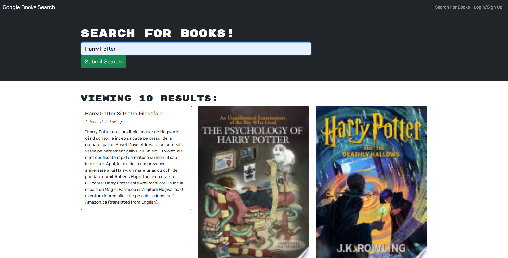

# Book Search Engine

## Description

A Google Books API search engine originally built with a RESTful API, then refactored to be a GraphQL API built with Apollo Server. The app was built using the MERN stack with a React front end, MongoDB database, and Node.js/Express.js server and API. It's set up to allow users to save book searches to the back end.

## Installation

To run this program locally, install the required node packages with the command:

```
npm install
```

Run the program locally with the command:

```
npm run develop
```

## Deployment

https://mario-book-engine.herokuapp.com/

## Screenshots

